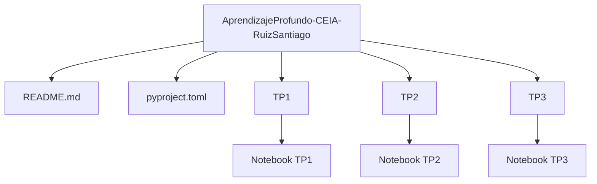

# AprendizajeProfundo-CEIA-RuizSantiago

Este repositorio corresponde a la materia Aprendizaje Profundo de la CEIA y estará organizado por entregas de trabajos prácticos.

## Requisitos

- Python 3.11 o 3.12
- [uv](https://docs.astral.sh/uv/getting-started/installation/)

## Ejecutar el notebook con uv

Desde la raíz del proyecto, ejecutá los siguientes comandos:

```powershell
cd E:\UBA\3B2026\AP\AprendizajeProfundo-CEIA-RuizSantiago
uv sync
uv run jupyter lab
```

Esto creará el entorno virtual del proyecto e instalará las dependencias definidas en `pyproject.toml`. Luego, en Jupyter Lab podés abrir el notebook ubicado en:

- `TP1/RUIZ-SANTIAGO-TP1-Co25.ipynb`

Si preferís abrirlo directamente desde la terminal, también podés hacerlo con:

```powershell
uv run jupyter notebook TP1/RUIZ-SANTIAGO-TP1-Co25.ipynb
```

> Si el kernel no aparece en VS Code, seleccioná el entorno creado por `uv` o ejecutá `uv run python -m ipykernel install --user --name aprendizaje-profundo`.

## Estructura futura del repositorio



## Notas

- El proyecto está pensado para crecer con un trabajo práctico por carpeta.
- Cada carpeta podrá contener sus propios notebooks, scripts y recursos auxiliares.

